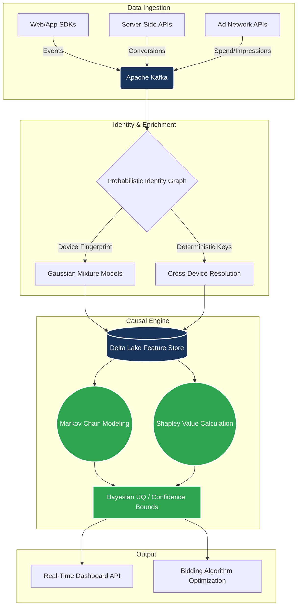

# The Forsythe Attribution & Measurement Framework
**A First-Principles Approach to Post-Cookie Marketing Science**

*Bridging the gap between "Marketing Spend" and "Causal Reality" for enterprise media budgets.*

---

## Executive Summary

With the deprecation of third-party cookies and the degradation of pixel tracking, traditional last-click attribution is mathematically obsolete. This repository serves as the central hub for the **Forsythe Attribution Framework**—a comprehensive 10-paper technical architecture combining **Bayesian Marketing Mix Modeling (MMM)**, **Causal Inference**, and **Real-Time Streaming Identity Resolution**.

> *"Most attribution is just weighted correlation with extra steps. We build systems grounded in first-principles causal frameworks."*

---

## The 10-Paper Technical Portfolio (Zenodo Published)

This complete measurement stack has been formally codified and published. Each paper addresses a specific failure point in modern marketing analytics and provides a mathematically defensible, production-ready solution.

| Part | Technical Focus & Title | Verifiable DOI Link |
|:---:|:---|:---|
| **I** | **Core Framework:** A First-Principles Hybrid Attribution Framework |  |
| **II** | **Optimization:** Bayesian Media Mix Modeling: Axiomatic Budget Optimization |  |
| **III** | **Psychographics:** Behavioral Profiling and Causal Uplift |  |
| **IV** | **Game Theory:** The Causal Calibration System |  |
| **V** | **Entity Resolution:** Probabilistic Identity Resolution |  |
| **VI** | **Broadcast Sync:** Live Event Attribution |  |
| **VII** | **Kafka Pipelines:** Real-Time Streaming Attribution |  |
| **VIII** | **Geo-Testing:** Incrementality Testing at Scale |  |
| **IX** | **Data Engineering:** Marketing Data Connectors |  |
| **X** | **Reconciliation:** The MMM-Incrementality Bridge |  |

*(Note: Full HTML versions of these whitepapers are hosted dynamically via [GitHub Pages](https://Michaelrobins938.github.io/attribution-assets/).)*

---

## System Architecture: The Artemis Streaming Engine

The theoretical frameworks above are operationalized via the **Artemis Engine**, a Kafka-native streaming pipeline designed for sub-100ms real-time attribution and identity resolution.

<b>View System Architecture (Mermaid Diagram)</b>

 

### Key Technical Pillars

1. **Markov Chain State Modeling:** For temporal causality, mapping the actual customer journey rather than relying on heuristic positions (First/Last Touch).
2. **Shapley Value Decomposition:** Ensuring game-theoretic fairness in distributing marginal credit to overlapping media channels.
3. **Bayesian Uncertainty Quantification (UQ):** Bounding epistemic vs. aleatoric error so media buyers understand the confidence interval of the reported ROAS.
4. **GDPR/CCPA Compliant Resolution:** Utilizing probabilistic clustering (Gaussian Mixtures) rather than relying on deprecating third-party cookies.

---

## Live Implementation & Open Source Code

While this repository houses the academic and theoretical assets, the active implementation of these frameworks can be viewed across my broader portfolio:

* **[first-principles-attribution](https://github.com/Michaelrobins938/first-principles-attribution):** The core causal logic repository.
* **[probabilistic-identity-resolution](https://github.com/Michaelrobins938/probabilistic-identity-resolution):** Real-time identity graph logic.
* **[behavioral-profiling-attribution](https://github.com/Michaelrobins938/behavioral-profiling-attribution):** Psychographic clustering models.

---

## Advisory & Fractional Engagements

I design, audit, and build production-grade measurement infrastructure for brands spending $1M+/month on media, and I advise high-growth agencies looking to white-label enterprise measurement capabilities.

**Connect to discuss your measurement architecture:**

*All research and frameworks within this repository are published under CC BY 4.0.*

