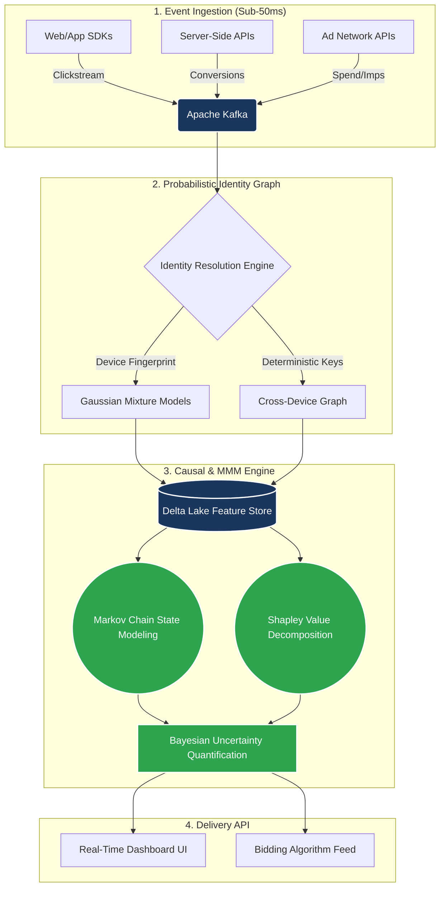

# 🏛️ The Forsythe Attribution & Measurement Framework
**A First-Principles Approach to Post-Cookie Marketing Science**

*Bridging the gap between "Marketing Spend" and "Causal Reality" for enterprise media budgets.*

---

## 📖 About the Framework

With the deprecation of third-party cookies and the degradation of pixel tracking, traditional last-click attribution is mathematically obsolete. Most "modern" attribution is simply weighted correlation disguised as data science.

This repository serves as the central hub for the **Forsythe Attribution Framework**—a comprehensive, peer-verifiable technical architecture combining **Bayesian Marketing Mix Modeling (MMM)**, **Causal Inference**, and **Real-Time Streaming Identity Resolution**. It is designed for data teams at brands spending $1M+/month on media who require measurement infrastructure they can mathematically defend.

---

## 📚 The 10-Paper Measurement Stack (Zenodo DOIs)

This complete measurement stack has been formally codified, compiled in LaTeX, and published. Each paper addresses a specific failure point in modern marketing analytics and provides a production-ready solution. Every framework ships with a **live interactive dashboard**.

| # | Technical Focus | Published Whitepaper | Official DOI | Live Demo |
|:---:|:---|:---|:---|:---|
| **I** | **Core Framework** | A First-Principles Hybrid Attribution Framework |  |  |
| **II** | **Optimization** | Bayesian Media Mix Modeling: Axiomatic Budget Optimization |  |  |
| **III** | **Psychographics** | Behavioral Profiling and Causal Uplift |  |  |
| **IV** | **Game Theory** | The Causal Calibration System |  |  |
| **V** | **Entity Resolution** | Probabilistic Identity Resolution |  |  |
| **VI** | **Broadcast Sync** | Live Event Attribution |  |  |
| **VII** | **Pipelines** | Real-Time Streaming Attribution |  |  |
| **VIII** | **Geo-Testing** | Incrementality Testing at Scale |  |  |
| **IX** | **Data Engineering**| Marketing Data Connectors |  |  |
| **X** | **Reconciliation** | The MMM-Incrementality Bridge |  |  |

*(📖 **Read the Docs:** Full HTML versions of these whitepapers are hosted dynamically via [GitHub Pages](https://Michaelrobins938.github.io/attribution-assets/).)*

### 🛰️ Extended Platform Dashboards

| Dashboard | Purpose |
|:---|:---|
|  | A/B testing and multi-armed bandit experiment management |
|  | Time-series forecasting with Prophet and hierarchical reconciliation |
|  | Central navigation hub across all live systems |

---

## ⚙️ System Architecture: The Artemis Engine

The theoretical frameworks above are operationalized via the **Artemis Engine**, a Kafka-native streaming pipeline designed for sub-100ms real-time attribution and identity resolution.

<b>🔍 View Engine Blueprint (Mermaid Architecture Diagram)</b>

 

### Core Engineering Pillars

1. **Markov Chain State Modeling:** Maps the actual temporal customer journey, destroying heuristic positions (First/Last Touch).
2. **Shapley Value Decomposition:** Ensures game-theoretic fairness in distributing marginal credit to overlapping media channels.
3. **Bayesian Uncertainty Quantification (UQ):** Bounds epistemic vs. aleatoric error so media buyers understand the actual confidence interval of the reported ROAS.
4. **GDPR/CCPA Compliant Resolution:** Utilizes probabilistic clustering rather than relying on deprecating cookies.

---

## 👨‍💻 About the Architect

**Michael Forsythe Robinson** is an AI Systems Architect and Marketing Science Engineer.

With over 5 years of experience building production-grade ML systems for Fortune 1000s and high-growth startups, Michael specializes in turning abstract causal inference theories into scalable, real-time data pipelines. He is the founder of Forsythe Publishing & Marketing, an agency providing fractional technical advisory and enterprise measurement capabilities.

* **Live Portfolio:** [Command Center](https://portfolio-hub-kappa-murex.vercel.app/)
* **Newsletter:** [The Measurement Standard](https://substack.com/@mforsytherobinson)
* **Contact:** [Connect on LinkedIn](https://www.linkedin.com/in/michael-forsythe-robinson-082255391/)

> *"If you can't measure the causal incrementality of the dollar, you are just guessing."*
