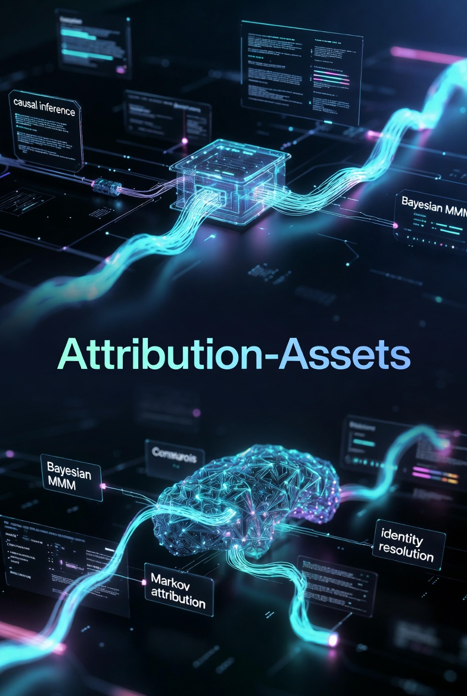

# 🏛️ The Forsythe Attribution & Measurement Framework
**A Global First-Principles Architecture for Enterprise Marketing Science**

*An end-to-end causal inference infrastructure bridging the gap between media spend and revenue reality.*

---

## 📖 About the Framework

With the deprecation of third-party cookies and the degradation of pixel tracking, traditional last-click attribution is mathematically obsolete. Most "modern" attribution is simply weighted correlation disguised as data science.

This repository serves as the central hub for the **Forsythe Attribution Framework**—a comprehensive, peer-verifiable technical architecture combining **Bayesian Marketing Mix Modeling (MMM)**, **Causal Inference**, and **Real-Time Streaming Identity Resolution**.

---

## ⚙️ Global System Architecture: The Artemis Engine

The theoretical frameworks are operationalized via a Kafka-native streaming pipeline designed for sub-100ms real-time attribution.

### Core Engineering Pillars

1. **Markov Chain State Modeling:** Maps the actual temporal customer journey, destroying heuristic positions (First/Last Touch).
2. **Shapley Value Decomposition:** Ensures game-theoretic fairness in distributing marginal credit to overlapping media channels.
3. **Bayesian Uncertainty Quantification (UQ):** Bounds epistemic vs. aleatoric error so media buyers understand the actual confidence interval of the reported ROAS.
4. **GDPR/CCPA Compliant Resolution:** Utilizes probabilistic clustering rather than relying on deprecating cookies.

---

## 📚 The 10-Paper Measurement Stack (Zenodo DOIs)

This complete measurement stack has been formally codified and published. Each paper addresses a specific failure point in modern marketing analytics.

| Pillar | Research Paper (Theory) | Verifiable DOI | Live Dashboard (Execution) |
|:---:|:---|:---|:---|
| **Foundation** | Hybrid Attribution Framework |  | [🚀 Streaming Engine](https://streaming-attribution-dashboard.vercel.app/) |
| **Optimization** | Bayesian Media Mix Modeling |  | [📊 MMM Optimizer](https://mmm-dashboard-mu.vercel.app/) |
| **Psychology** | Behavioral Profiling & Uplift |  | [🧠 Profiling Hub](https://behavioral-profiling-dashboard.vercel.app/) |
| **Calibration** | The Causal Calibration System |  | [🔬 Inference Suite](https://causal-inference-dashboard.vercel.app/) |
| **Identity** | Probabilistic ID Resolution |  | [🆔 Identity Demo](https://identity-resolution-demo.vercel.app/) |
| **Real-Time** | Live Event Attribution |  | [📺 WWE Raw Sync](https://live-event-attribution-dashboard.vercel.app/) |
| **Pipelines** | Real-Time Streaming Attribution |  | [🚀 Streaming Engine](https://streaming-attribution-dashboard.vercel.app/) |
| **Geo-Testing** | Incrementality Testing at Scale |  | [🧪 Testing Lab](https://incrementality-testing-dashboard.vercel.app/) |
| **Data Eng** | Marketing Data Connectors |  | [🔌 Connector Hub](https://frontend-pi-eight-70.vercel.app/) |
| **Reconciliation** | The MMM-Incrementality Bridge |  | [📈 MMM Bridge](https://mmm-dashboard-mu.vercel.app/) |

| Extended Platform | Live Dashboard |
|:---|:---|
| Experimentation Platform | [⚗️ A/B & Bandit Testing](https://experimentation-platform-dashboard.vercel.app/) |
| Demand Forecasting | [📈 Forecast System](https://demand-forecasting-dashboard-wine.vercel.app/) |
| Portfolio Command Center | [🛰️ Central Hub](https://portfolio-hub-kappa-murex.vercel.app/) |

*(📖 Full HTML versions of all whitepapers are hosted via [GitHub Pages](https://Michaelrobins938.github.io/attribution-assets/).)*

---

## 👨‍💻 About the Architect

**Michael Forsythe Robinson** is a Marketing Science Engineer and AI Systems Architect.

He specializes in the engineering of high-scale data systems that transform complex behavioral signals into actionable causal truth. As the founder of **Forsythe Publishing & Marketing**, he provides technical advisory for enterprise brands and high-growth agencies.

* **Main Hub:** [Portfolio Command Center](https://portfolio-hub-kappa-murex.vercel.app/)
* **Direct Reach:** [LinkedIn](https://www.linkedin.com/in/michael-forsythe-robinson-082255391/) | `Forsythepublishing@gmail.com`

---

All research assets are published under CC BY 4.0. Powered by the Forsythe Measurement Standard.

